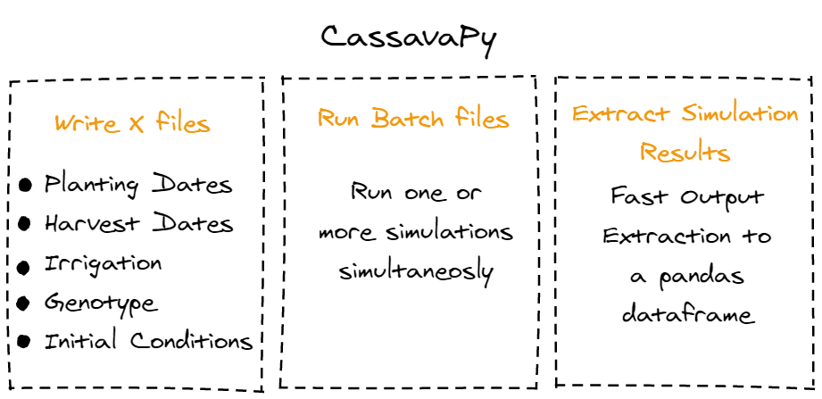

# CassavaPy

  A simple module to write files, run simulations and get outputs from DSSAT-Manihot model

  
 

---

### Why CassavaPy?

Apart from get hands dirty with OOP, the aim of this module is to make my life easier during my master degree.
Since my work is with irrigation and planting dates, the focus of CassavaPy is there.

---

### What CassavaPy can do?

1. **Create Experimental and Seasonal files and change the following:**

* Planting Dates
* Harvest Dates
* Irrigation Management
* Field (Soil and Weather Station) - **One by File**
* Soil Water Initial Conditions
* Simulation Start Date
* Genotype - **One by File**

2. **Create and Run Batch Files**

* For Seasonal
* For Experimental

3. **Get Simulation Outputs**

---

### How CassavaPy will be improved in the near future?

**1) I am working on a [Documentation](https://cassavapy.readthedocs.io/en/latest/)**

**2) Allows to put more than one *Genotype* by file** 

---

